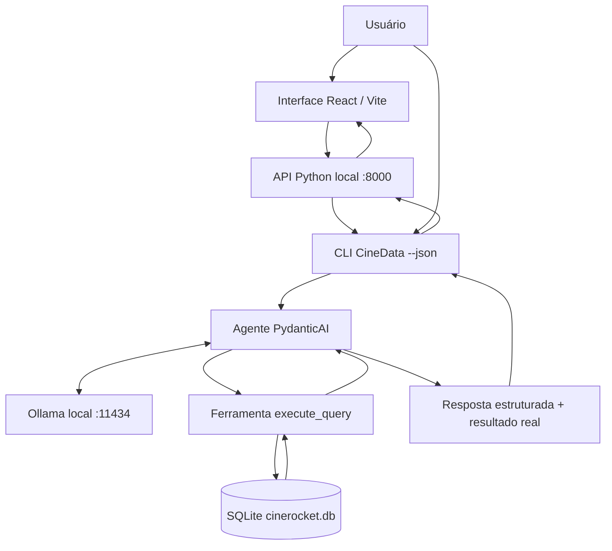

# 🎬 RocketLabAI — CineData

**Explore um catálogo de cinema usando perguntas em português, com IA executada localmente.**

O CineData transforma perguntas em consultas SQLite e apresenta os resultados no terminal ou em uma interface React. O projeto combina um agente PydanticAI, um modelo servido pelo Ollama e o banco `cinerocket.db`.

> Exemplo: **“Quais são os 15 filmes com maior faturamento em reais?”**
>
> O agente interpreta a pergunta, gera SQL, consulta o banco e retorna os títulos e valores encontrados. A consulta executada fica disponível para conferência.

## Sumário

- [Recursos](#recursos)
- [Arquitetura](#arquitetura)
- [Requisitos](#requisitos)
- [Instalação](#instalação)
- [Como usar](#como-usar)
- [Banco e regras de análise](#banco-e-regras-de-análise)
- [Validação com respostas JSON](#validação-com-respostas-json)
- [Testes automatizados](#testes-automatizados)
- [Estrutura do projeto](#estrutura-do-projeto)
- [Limitações e diagnóstico](#limitações-e-diagnóstico)

## Recursos

- Perguntas em linguagem natural sobre filmes, pessoas, gêneros, produtoras e avaliações.
- Geração de SQL pelo modelo a partir do esquema do banco.
- Consultas ao SQLite com acesso de leitura e restrições de execução.
- Respostas estruturadas com explicação, SQL e dados retornados.
- Terminal interativo e execução de perguntas individuais em JSON.
- Interface React com tabela, formatação monetária, tempo de espera e SQL expansível.
- Execução local, sem chave de API de um serviço externo.

A IA não se limita aos exemplos deste documento. Ela gera consultas para novas perguntas dentro das informações disponíveis no banco. Isso não garante que toda interpretação ou consulta esteja correta.

## Arquitetura



1. O programa carrega a configuração e o esquema real do banco.
2. O modelo recebe a pergunta, o esquema e as regras de negócio.
3. O agente utiliza `execute_query` para executar o SQL gerado.
4. A validação exige que o SQL da resposta tenha sido executado naquela chamada.
5. O programa anexa os resultados armazenados pela ferramenta ao JSON final.

**Responsabilidades:** a IA gera a interpretação, a explicação e o SQL. O SQLite fornece as linhas de dados. Python organiza a resposta e React a apresenta.

A API web reutiliza o CLI em um subprocesso; não implementa um segundo agente. Ela atende uma consulta por vez. As perguntas feitas pela interface são independentes. No terminal interativo, há histórico limitado aos últimos três turnos.

## Requisitos

| Componente | Uso |
| --- | --- |
| Python 3.12 ou superior | Aplicação e API local |
| uv | Ambiente virtual e dependências Python |
| Git e Git LFS | Código e download do banco |
| Ollama | Execução do modelo local |
| Modelo `cinedata-rocket` | Modelo configurado por padrão |
| Node.js e npm compatíveis com Vite 6 | Instalação e execução do frontend |

Ambiente utilizado durante o desenvolvimento: **Fedora, 16 GB de RAM e NVIDIA RTX 2050**. Essa configuração é uma referência do desenvolvimento, não uma especificação mínima certificada. O desempenho depende do modelo, da memória disponível e da distribuição da carga entre CPU e GPU.

A instalação inicial requer internet para baixar código, banco, dependências e modelo. Depois desses downloads, as consultas usam os serviços locais. O cliente do modelo aponta para `http://127.0.0.1:11434/v1`; o uso do SDK OpenAI é para compatibilidade com essa API local.

## Instalação

Escolha o roteiro do seu sistema. Ambos começam em **um computador sem as ferramentas do projeto instaladas**:

- [Fedora](#instalação-no-fedora)
- [Windows](#instalação-no-windows)

**Verificação do download:** em 05/10/2026, um clone novo do commit `974a4f4` baixou o banco pelo Git LFS sem comandos de restauração. O arquivo tinha 581.120.000 bytes, SHA-256 `410f5beef6ab9fb34b9044d5dd191f56f3f0dc30a56e6432386ecef0d977b012`, e retornou 95.645 registros em `dim_movies`. Isso verifica o download e a leitura do banco, não toda a instalação Windows.

Execute os comandos na ordem e aguarde cada etapa terminar. Se algum comando falhar, resolva o erro antes de continuar. É necessário acesso à internet para baixar as ferramentas, as dependências, o banco e o modelo. Nas próximas execuções, esses downloads não precisam ser repetidos.

O arquivo `Modelfile` está versionado na raiz do repositório e será obtido no clone. Ele contém:

```dockerfile
FROM qwen3:4b-instruct-2507-q4_K_M
PARAMETER num_ctx 8192
PARAMETER temperature 0
```

Esse modelo-base está disponível na [biblioteca do Ollama](https://ollama.com/library/qwen3:4b-instruct-2507-q4_K_M). A definição não contém caminhos específicos de Linux ou Windows. O comando `ollama pull` abaixo baixa os pesos e `ollama create` cria o nome `cinedata-rocket` usado pelo projeto.

### Instalação no Fedora

#### 1. Instale Git, Git LFS, Node.js e npm

Abra o Terminal e execute:

```bash
sudo dnf install git git-lfs curl nodejs npm
```

#### 2. Instale uv e Ollama

Use os instaladores oficiais:

```bash
curl -LsSf https://astral.sh/uv/install.sh | sh
curl -fsSL https://ollama.com/install.sh | sh
```

Referências: [instalação do uv](https://docs.astral.sh/uv/getting-started/installation/) e [instalação do Ollama no Linux](https://docs.ollama.com/linux).

Feche o terminal e abra outro para carregar os caminhos instalados. Confira:

```bash
git --version
git lfs version
uv --version
node --version
npm --version
ollama --version
```

Se algum comando não for reconhecido, confira sua instalação. Use Node.js compatível com Vite 6; se o pacote do seu Fedora estiver desatualizado, consulte a [instalação oficial do Node.js LTS](https://nodejs.org/en/download).

#### 3. Clone o projeto em uma pasta nova

```bash
mkdir -p "$HOME/Projetos"
cd "$HOME/Projetos"
git lfs install
git clone https://github.com/ThIagoMedeiros21/RocketLabAI.git
cd RocketLabAI
git lfs pull origin
```

Este roteiro instala o projeto em uma pasta nova. Espere o comando `git clone` terminar: ele também pode baixar o banco pelo LFS antes de devolver o prompt. Se a pasta `RocketLabAI` já existir, escolha outra pasta para o clone; não reutilize uma cópia com alterações locais.

#### 4. Instale Python e as dependências

Ainda na raiz do projeto:

```bash
uv python install 3.12
uv sync --locked --python 3.12
```

O uv instala o Python, cria `.venv` e instala as dependências. Não é necessário ativar o ambiente virtual manualmente.

Confirme que o banco foi realmente baixado:

```bash
uv run python -c "from pathlib import Path; p=Path('cinerocket.db'); assert p.is_file(), 'Banco ausente'; f=p.open('rb'); h=f.read(16); f.close(); assert h == b'SQLite format 3\x00', 'Arquivo nao e SQLite: confira o Git LFS'; print('SQLite confirmado:', p.stat().st_size, 'bytes')"
```

O banco observado no desenvolvimento tem **581.120.000 bytes**, aproximadamente 554 MiB. A verificação deve mostrar `SQLite confirmado`. Apenas executar `git lfs ls-files` não confirma a presença do banco na pasta.

#### 5. Crie o arquivo .env

Execute este bloco inteiro na raiz `RocketLabAI`:

```bash
cat > .env <<'ENV'
DB_PATH=cinerocket.db
MODELO_LLM=cinedata-rocket
DB_SNAPSHOT=false
ENV
```

#### 6. Inicie o Ollama e baixe o modelo

```bash
sudo systemctl start ollama
ollama list
```

Se sua instalação não tiver o serviço systemd, abra outro terminal, execute `ollama serve` e mantenha-o aberto. Não inicie uma segunda instância se o serviço já estiver respondendo.

No terminal do projeto:

```bash
ls -l Modelfile
ollama pull qwen3:4b-instruct-2507-q4_K_M
ollama create cinedata-rocket -f Modelfile
ollama list
```

Aguarde os downloads e a criação terminarem. A lista final deve conter `cinedata-rocket`. Se o arquivo não for encontrado, confirme que o terminal está na raiz do projeto e que você clonou a versão atual.

#### 7. Teste o agente

```bash
uv run cinedata-chat --json "Quantos filmes existem no banco?"
```

Com a mesma versão do banco, a contagem esperada é **95.645 filmes**. Só prossiga para a interface depois que esse comando funcionar.

#### 8. Inicie a interface

No **primeiro terminal**, inicie a API:

```bash
cd "$HOME/Projetos/RocketLabAI"
uv run python -m cinedata.web
```

No **segundo terminal**, instale as versões registradas no `package-lock.json` e inicie o React:

```bash
cd "$HOME/Projetos/RocketLabAI/frontend"
npm ci
npm run dev
```

Abra **http://127.0.0.1:5173**. Deixe o Ollama e os dois terminais ativos.

Nas próximas vezes, inicie o Ollama e repita apenas os comandos dos dois terminais, sem `npm ci`. Use `Ctrl+C` para parar os servidores.

### Instalação no Windows

Use o **PowerShell**, disponível no menu Iniciar. Este roteiro não exige Git Bash, WSL, Docker ou editor de código. Confira os [requisitos do Ollama no Windows](https://docs.ollama.com/windows) para seu sistema e drivers.

#### 1. Baixe e instale as ferramentas

Abra os links no navegador e execute os instaladores:

| Ferramenta | Download oficial | Durante a instalação |
| --- | --- | --- |
| Git for Windows | [Baixar Git](https://git-scm.com/downloads/win) | Permita o uso do Git pela linha de comando |
| Git LFS | [Baixar Git LFS](https://git-lfs.com/) | Instale caso não tenha vindo incluído no Git |
| Node.js LTS | [Baixar Node.js](https://nodejs.org/en/download) | Mantenha npm e inclusão no PATH |
| Ollama | [Baixar Ollama](https://ollama.com/download/windows) | Instale e abra o aplicativo |

O Python será baixado pelo uv na etapa 4. Não é necessário instalá-lo separadamente.

#### 2. Instale uv e confira os comandos

Abra o PowerShell e execute o instalador oficial:

```powershell
powershell -ExecutionPolicy ByPass -c "irm https://astral.sh/uv/install.ps1 | iex"
```

Referência: [instalação do uv](https://docs.astral.sh/uv/getting-started/installation/).

Feche o terminal e abra um **novo PowerShell** para carregar os caminhos das ferramentas. Confira:

```powershell
git --version
git lfs version
uv --version
node --version
npm.cmd --version
ollama --version
```

Todos devem mostrar uma versão. Se aparecer “comando não reconhecido”, confira a instalação correspondente antes de seguir. `npm.cmd` evita depender da execução de `npm.ps1` no PowerShell.

#### 3. Clone o projeto e baixe o banco

```powershell
New-Item -ItemType Directory -Force "$HOME\Projetos"
Set-Location "$HOME\Projetos"
git lfs install
git clone https://github.com/ThIagoMedeiros21/RocketLabAI.git
Set-Location RocketLabAI
git lfs pull origin
```

Os comandos usam a pasta `Projetos` dentro da sua pasta de usuário. Aguarde o `git clone` terminar: o banco pode ser baixado pelo LFS durante essa etapa. Se já existir uma cópia `RocketLabAI`, escolha outra pasta para o clone. Prefira clonar pelo Git para obter o banco com Git LFS.

#### 4. Instale Python e as dependências

```powershell
uv python install 3.12
uv sync --locked --python 3.12
```

O uv baixa o Python e cria o ambiente `.venv` automaticamente. Use `uv run`; não é necessário ativar esse ambiente.

Confira o banco:

```powershell
uv run python -c "from pathlib import Path; p=Path('cinerocket.db'); assert p.is_file(), 'Banco ausente'; f=p.open('rb'); h=f.read(16); f.close(); assert h == b'SQLite format 3\x00', 'Arquivo nao e SQLite: confira o Git LFS'; print('SQLite confirmado:', p.stat().st_size, 'bytes')"
```

O resultado deve começar com `SQLite confirmado`. Na versão utilizada no desenvolvimento, o tamanho é **581.120.000 bytes**.

#### 5. Crie o arquivo .env

Ainda na raiz `RocketLabAI`, copie este bloco inteiro:

```powershell
@"
DB_PATH=cinerocket.db
MODELO_LLM=cinedata-rocket
DB_SNAPSHOT=false
"@ | Set-Content -Encoding ascii .env
```

#### 6. Baixe e crie o modelo

Abra o **Ollama pelo menu Iniciar**. No terminal do projeto:

```powershell
ollama list
Get-Item .\Modelfile
ollama pull qwen3:4b-instruct-2507-q4_K_M
ollama create cinedata-rocket -f .\Modelfile
ollama list
```

A primeira lista pode estar vazia; a última deve conter `cinedata-rocket`. Espere o download e a criação terminarem. Se `Get-Item` não encontrar o arquivo, confirme que o terminal está na raiz do projeto e que você clonou a versão atual.

Se houver erro de conexão, confirme que o aplicativo Ollama está aberto. Como alternativa, execute `ollama serve` em outro terminal e mantenha-o aberto. Não inicie outra instância se o serviço já estiver ativo.

#### 7. Teste o agente

```powershell
uv run cinedata-chat --json "Quantos filmes existem no banco?"
```

Na versão original do banco, a contagem foi **95.645 filmes**. Se o comando falhar, resolva o erro antes de abrir a interface.

#### 8. Inicie a interface

**Primeiro PowerShell — API:**

```powershell
Set-Location "$HOME\Projetos\RocketLabAI"
uv run python -m cinedata.web
```

**Segundo PowerShell — React:**

```powershell
Set-Location "$HOME\Projetos\RocketLabAI\frontend"
npm.cmd ci
npm.cmd run dev
```

Abra **http://127.0.0.1:5173** no navegador. Mantenha o Ollama e os dois terminais ativos. Não precisa abrir o chat interativo em paralelo.

Nas próximas vezes, abra o Ollama e repita somente os comandos dos dois terminais, omitindo `npm.cmd ci`. Para encerrar os servidores, pressione `Ctrl+C`.

O roteiro Windows foi revisado com a documentação oficial, mas ainda não foi executado em uma instalação Windows durante esta revisão.

## Como usar

### Terminal interativo

```bash
uv run cinedata-chat
```

Digite uma pergunta no prompt. Comandos disponíveis:

- `limpar`: reinicia o histórico da conversa.
- `sair`: encerra o chat.

### Pergunta individual

```bash
uv run cinedata-chat "Os 15 filmes com maior faturamento em reais"
```

### Resposta em JSON

```bash
uv run cinedata-chat --json "Os 10 filmes mais populares lançados após o ano 2000"
```

Opções adicionais:

| Opção | Finalidade |
| --- | --- |
| `--db CAMINHO` | Escolher outro banco |
| `--model NOME` | Escolher outro modelo local |
| `--date AAAA-MM-DD` | Fixar a data de referência de consultas temporais |
| `--trace` | Exibir diagnóstico, usando `trace.py` |
| `--snapshot` | Ativar o modo de banco estático |

Evite combinar `--trace` com arquivos de evidência JSON, pois o diagnóstico pode acrescentar texto à saída.

### Interface React

**Terminal 1 — API, na raiz do projeto:**

```bash
uv run python -m cinedata.web
```

**Terminal 2 — frontend, a partir da raiz do projeto:**

```bash
cd frontend
npm ci
npm run dev
```

Abra **http://127.0.0.1:5173**. O Ollama também precisa estar ativo. Não é necessário abrir o chat interativo: a API inicia o CLI automaticamente a cada pergunta.

A tela permite escrever perguntas livres, selecionar exemplos, acompanhar o tempo decorrido, consultar tabelas e expandir o SQL executado. O tempo mostrado é de espera, não uma porcentagem de progresso. Fechar a aba não cancela a geração em andamento.

Para verificar o build:

```bash
cd frontend
npm run build
```

Esse comando gera os arquivos estáticos em `frontend/dist`. A integração descrita aqui utiliza o servidor local do Vite e seu proxy `/api`; o build, sozinho, não inicia a API nem configura uma hospedagem de produção.

### API local

Endpoint: `POST http://127.0.0.1:8000/api/perguntar`

```bash
curl http://127.0.0.1:8000/api/perguntar \
  -H 'Content-Type: application/json' \
  -d '{"pergunta":"Quantos filmes existem no banco?"}'
```

Aceita perguntas de até 2.000 caracteres. Retorna a mesma estrutura JSON do CLI. Os principais códigos de erro são `400` para entrada inválida, `409` para consulta já em andamento e `502` para falha do agente. Os detalhes da falha ficam no terminal da API. O servidor escuta apenas em `127.0.0.1`.

## Banco e regras de análise

A contagem observada é de **95.645 filmes cadastrados**. Não há registro de uma operação de correção de filmes ou de quantos registros teriam sido corrigidos. Os ajustes documentados foram feitos no código e nas instruções do agente; a aplicação consulta o banco em modo de leitura.

| Tabela | Conteúdo |
| --- | --- |
| `dim_movies` | Filmes e informações de lançamento |
| `fact_movies_performance` | Receita, orçamento, popularidade, notas e votos |
| `dim_people` | Pessoas e funções, como ator e diretor |
| `dim_genres` | Gêneros |
| `dim_companies` | Produtoras |
| `dim_reviews` | Avaliações de usuários agregadas por filme |
| `movie_reviews` | Avaliações individuais |
| `bridge_movie_person` | Relações entre filmes e pessoas |
| `bridge_movie_genre` | Relações entre filmes e gêneros |
| `bridge_movie_company` | Relações entre filmes e produtoras |

Regras orientadas ao agente:

- Receita, faturamento e bilheteria usam as colunas em BRL por padrão, sem reconversão monetária.
- Popularidade e nota são métricas diferentes.
- Lucro corresponde a receita menos orçamento e exige ambos informados.
- Margem de lucro é `(receita − orçamento) / receita × 100`, com receita positiva.
- Retorno **receita ÷ orçamento** exige orçamento positivo. Esse múltiplo difere de `(receita − orçamento) / orçamento`.
- Ausência de informação é representada por `NULL`, não por zero.
- Relações muitos-para-muitos exigem cuidado para evitar contagens e somas duplicadas.
- Em análises por gênero ou produtora, atribuir o valor integral de um filme a cada grupo torna os totais dos grupos não aditivos.

A camada SQLite abre o banco em leitura, habilita `query_only`, limita tabelas e funções autorizadas e restringe a execução. Por padrão, retorna até 100 linhas e sinaliza truncamento. O prazo padrão de execução SQL é de 10 segundos; esse prazo é diferente do tempo de geração da IA.

## Validação com respostas JSON

As validações manuais usam **perguntas reais enviadas ao agente**, com `--json`. Elas permitem registrar a interpretação, o SQL produzido e o resultado do banco para revisão.

### Estrutura da resposta

O exemplo abaixo apresenta uma resposta de contagem observada durante o desenvolvimento, com a explicação resumida para documentação:

```json
{
  "resposta": "O catálogo contém 95.645 filmes.",
  "sql": "SELECT COUNT(*) AS total_filmes FROM dim_movies",
  "esclarecimento": "",
  "resultado": {
    "colunas": ["total_filmes"],
    "linhas": [[95645]],
    "truncado": false
  }
}
```

| Campo | Significado |
| --- | --- |
| `resposta` | Explicação gerada pela IA |
| `sql` | Consulta executada; vazio quando há pedido de esclarecimento |
| `esclarecimento` | Pergunta adicional quando necessária |
| `resultado.colunas` | Nomes das colunas retornadas |
| `resultado.linhas` | Valores reais obtidos no SQLite |
| `resultado.truncado` | Indica se o limite de linhas cortou o resultado |

### Casos observados no desenvolvimento

Estas evidências vêm das execuções relatadas durante o desenvolvimento; não representam uma nova execução automática a cada atualização do projeto.

| Pergunta | Resultado observado | Avaliação |
| --- | --- | --- |
| Quantos filmes existem no banco? | 95.645 filmes | Contagem retornada com sucesso |
| Os 15 filmes com maior faturamento em reais | 15 linhas, lideradas por Avatar: The Way Of Water, com R$ 12.390.136.500,54 | Ordenação por receita retornada com sucesso |
| Os 10 filmes mais populares lançados após 2000 | 10 linhas, lideradas por Blue Beetle, popularidade 2994.357 | Filtro de ano e ordenação retornados com sucesso |
| Quantos filmes temos disponíveis? | Zero ao filtrar `status_filme = 'Disponível'` | Erro de interpretação identificado; regra de linguagem proposta e precisa de revalidação |
| Dupla ator-diretor com maior média IMDb, mínimo de 3 filmes | Houve SQL associando ator e diretor pelo mesmo ID de pessoa | Caso complexo com falha conhecida; não considerado validado |

### Como salvar novas evidências

Execute os comandos na raiz do projeto, um de cada vez:

```bash
mkdir -p docs/evidencias

uv run cinedata-chat --json "Quantos filmes existem no banco?" \
  > docs/evidencias/contagem.json

uv run cinedata-chat --json "Os 15 filmes com maior faturamento em reais" \
  > docs/evidencias/bilheteria.json

uv run cinedata-chat --json "Os 10 filmes mais populares lançados após o ano 2000" \
  > docs/evidencias/popularidade.json
```

Confira se cada comando terminou sem erro e se o JSON é válido:

```bash
uv run python -m json.tool docs/evidencias/contagem.json
```

Não registre arquivos vazios como evidência de sucesso. O redirecionamento pode criar um arquivo mesmo quando a consulta falha. Versione as evidências revisadas e registre junto delas a pergunta, a data de execução, o modelo e a versão do banco. Para comparações temporais, fixe `--date`.

**Critérios de conferência:** examine se os filtros correspondem à pergunta, se os joins relacionam as entidades certas, se a métrica está correta, se o limite e a ordenação fazem sentido e se as linhas coincidem com uma consulta de referência revisada.

Um JSON válido demonstra que a saída está estruturada. SQL executado com sucesso demonstra que a consulta foi aceita pelo banco. **Nenhum dos dois, isoladamente, comprova a correção semântica da resposta ou a capacidade de responder qualquer pergunta.**

### Outras perguntas para avaliação

- Os 5 filmes com mais votos no IMDb entre 2010 e 2020, com suas notas IMDb.
- Ano de lançamento com maior arrecadação total em reais.
- Os 10 filmes com maior razão receita/orçamento, com orçamento mínimo de R$ 1 milhão.
- Os 3 atores com mais participações em filmes lançados nos últimos 10 anos.
- As 5 produtoras com maior número de filmes.
- Filme mais popular de cada gênero.

Esses itens são um roteiro de avaliação, não uma declaração de aprovação.

## Testes automatizados

O arquivo `tests/validacao/test_base.py` testa a infraestrutura usando um banco temporário:

- leitura e limite de resultados;
- bloqueio de escrita e de acesso a tabelas não autorizadas;
- parâmetros SQL;
- interrupção por tempo e recuperação da conexão;
- inspeção do esquema;
- formatação de moeda e valores ausentes;
- inicialização, limpeza e saída do CLI.

```bash
uv sync --group dev --locked
uv run --group dev python -m pytest tests/validacao/test_base.py -v
```

Esses testes **não enviam perguntas à IA**. As evidências JSON documentam exercícios com o modelo real e complementam os testes de infraestrutura. A existência dos testes não equivale a uma execução aprovada; registre o resultado ao executá-los.

## Estrutura do projeto

```text
RocketLabAI/
├── frontend/
│   ├── src/
│   │   ├── main.jsx          # Interface e chamadas à API
│   │   └── style.css         # Estilos responsivos
│   ├── index.html
│   ├── package.json
│   └── vite.config.js        # Servidor local e proxy da API
├── src/cinedata/
│   ├── agente.py             # Agente, ferramentas, validação e CLI
│   ├── config.py             # Ambiente e cliente Ollama
│   ├── dados.py              # Acesso controlado ao SQLite
│   ├── prompts.py            # Regras de interpretação e negócio
│   ├── apresentacao.py       # Tabelas do terminal
│   ├── trace.py              # Diagnóstico opcional
│   └── web.py                # API da interface React
├── tests/validacao/
│   ├── conftest.py
│   └── test_base.py
├── Modelfile                # Definição do modelo local no Ollama
├── cinerocket.db             # Banco distribuído via Git LFS
├── .gitattributes            # Regras do Git LFS
├── .gitignore
├── pyproject.toml
├── uv.lock
└── README.md
```

`docs/evidencias/` é criada ao salvar as validações JSON. `.env`, `.venv`, `node_modules` e arquivos temporários não devem ser versionados. Mantenha os arquivos de configuração Python, o `uv.lock` e o `frontend/package-lock.json` no repositório.

## Limitações e diagnóstico

| Sintoma | Verificação |
| --- | --- |
| `No module named cinedata.config` | Confira se `src/cinedata/config.py` foi incluído no clone |
| Modelo não encontrado ou erro de conexão | Execute `ollama list`, confira `MODELO_LLM` e o serviço |
| Banco inválido após clone | Execute `git lfs pull`; confira se o arquivo baixado é o banco real |
| Consulta demora | Verifique `ollama ps`; CPU/GPU, contexto e tentativas afetam a latência |
| `Exceeded maximum output retries` | O modelo não satisfez o formato ou a validação; examine o diagnóstico |
| Resposta zero inesperada | Confira o SQL antes de concluir que não há dados |
| Erro na interface | Leia o terminal da API; teste a mesma pergunta pelo CLI |
| HTTP 409 | Aguarde a consulta em andamento terminar |

No Fedora, se o Ollama estiver instalado como serviço, acompanhe os logs com:

```bash
journalctl -u ollama -f -n 20
```

A configuração atual não estabelece prazo total para a resposta do modelo. Uma geração pode demorar ou ficar pendente; o relógio da interface não prova progresso do modelo. A aplicação não oferece cancelamento pela interface.

O agente pode produzir SQL válido com interpretação errada, especialmente em joins complexos ou expressões ambíguas. Valores incomuns do catálogo são preservados; o projeto não garante a qualidade dos dados de origem. Revise os resultados antes de utilizá-los em análises.

A interface atual foi preparada para uso local. Autenticação, múltiplos usuários, sessões web persistentes, streaming e implantação pública não fazem parte da implementação descrita.
